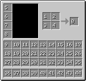

# Inventory
{: .no_toc }
Inventories/Windows behave quite differently to how one'd expect. On the network side the slots tend to be counted from the one that's top-left down to the one that's bottom-right. Due to how the player inventory is counted and stored, some conversion is necessary, depending on which inventory is open and what slot was clicked.

Each inventory/window also has a unique identifier/index.

{: .note }
> For the NBT-side, repeated numbers do not mean that slots are shared. Separate inventories count their slots independently.

1. TOC
{:toc}

## Player
The player inventory has no index. It has a few obvious oddities between how its sent over the network and how its stored, namely the armor slots starting at index 100 and being ordered bottom to top.

| Network | NBT |
| :---: | :---: |
|  |  |

{: .note }
> The items in the crafting grid appear to not have a slot associated with them when saved or loaded to NBT.

{: .note }
> The result slot cannot be altered over the network, always showing up as whatever the client thinks should be there. However, the client still expects the 0th slot to be sent.

## Chest (0)
Chests have an index of `0`.

| Network | NBT |
| :---: | :---: |
|  |  |

Large Chests are just normal chests that happen to be adjacent when opened. They do not share a tile entity entry, and as such count/store their slots separately.

| Network | NBT |
| :---: | :---: |
|  |  |

It appears the chest that is visually to the left represents the upper half of the large chest, while the right represents the lower half.

## Crafting Table (1)
Crafting Tables have an index of `1`.

| Network | NBT |
| :---: | :---: |
|  |  |

{: .note }
> Crafting Tables are not tile entities and store no NBT data!

## Furnace (2)
Furnaces have an index of `2`.

| Network | NBT |
| :---: | :---: |
|  |  |

## Dispenser (3)
Dispensers have an index of `3`.

| Network | NBT |
| :---: | :---: |
|  |  |

## Outside (-999)
This is not any valid inventory. If the number `-999` is sent over the network, it means the player has clicked outside of an open inventory/window.