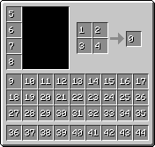

# Player
{: .no_toc }
The player is the entity the client has direct control over.

1. TOC
{:toc}

## NBT
### Inventory Slots
The inventory slot layout between how it is over the network and how it is when stored to an NBT is very different.

| Network | NBT |
| :---: | :---: |
|  |  |

{: .note }
> The items in the crafting grid appear to not have a slot associated with them when saved or loaded to NBT.