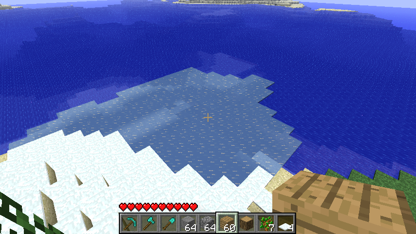

# Quirks

Quirks are often unintentional or unintuitive behaviors that occur due to poorly written or erroneous code. In spite of that, these are part of the Vanilla game, and a 100% accurate reimplementation should implement them as well.

## Ice and Snow

Ice is generated during the [terrain shape stage](../worlds/generation#terrain-shape) anywhere the temperature is less than `0.5`. **However** this does not line up completely with the later determined biomes, which then determine where ice and snow can form via random ticking.

|                                                     Unticked                                                     |                                                   Ticked                                                    |
| :--------------------------------------------------------------------------------------------------------------: | :---------------------------------------------------------------------------------------------------------: |
|  |  |

This becomes more apparent when the relevant values are visualized.

|                                                                Biomes (Map Colors) + Temp < 0.5 (Red)                                                                 |
| :-------------------------------------------------------------------------------------------------------------------------------------------------------------------: |
|  |

Biome map with Map colors, Red marking where temperature values are less than 0.5

Snow depends on the same system to determine where it can appear, though its placed later in the [population stage](../worlds/population).

> [!NOTE]
> Seed for this section is `-1712183887779554298`, showing the area around chunk `x: -1, z:6`

## Farlands

The farlands are an extremely well-known terrain-generation artifact that occurs approximately `+/-12,550,821` away from `(0,0)`. [The Minecraft Wiki has a highly detailed explanation of why they happen](<https://minecraft.wiki/w/Far_Lands_(Java_Edition)/Infdev_20100327_to_Beta_1.7.3#Cause>) but the simplified reason can be summed up as follows.

To read data from the perlin-noise permutation table, the position the noise is sampled at must be turned into an integer.

Due to how java Java converts between types (see [Casting](../technical/javaFeatures#casting)), the resulting 32-bit Integer (`int`) always lands on the same permutation table entry, giving us the familiar, infinitely stretching tunnels.

Using a signed 64-bit Integer (`long`) can fix this problem but it changes the tree and terrain generation slightly due to rounding differences.

# Wooden slab

Wooden slabs before 1.3.1 were retextured stone slabs. As a result, they required a Pickaxe to mine effectively, and produced stone particles when hit. The item was replaced by the modern wooden slab in 1.3.1, and renamed to "Petrified Oak Slab" in 1.13 ([See MC Wiki](https://minecraft.wiki/w/Petrified_oak_slab)).

# Redstone

## Quasi-connectivity

TODO

## Double-trigger

If a Dispenser is already being powered by a lever or redstone torch, a buttons can trigger Dispensers twice on both when it presses and resets. This is because the Dispenser gets a redstone-based block update, then checks if its being powered, discovering the power by the lever/redstone torch.

# Entity Id overflow

The id of entities is stored as a signed 32-bit integer, which has a maximum value of `2,147,483,647`. While it's unlikely for anyone to reach or suprass this number under normal circumstances, there are certain effects that potentially occur if this number ever overflows. Any situation where the game just immediately crashes will be ignored.

## Spawn Object Packet

The [spawn object packet](../networking/packets/023-spawn-object) determines if an entity, such as an Arrow, has an initial velocity by checking if the owner entity id is greater than `0`. If the global entity id overflows into the negatives, all arrows and fireballs would be sent without an initial velocity.
