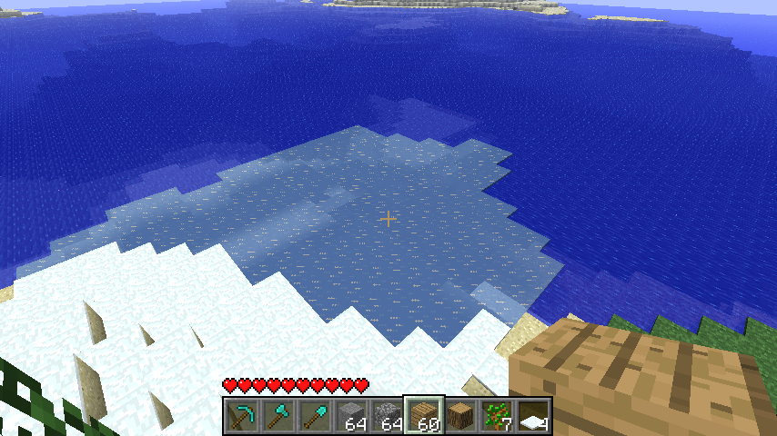
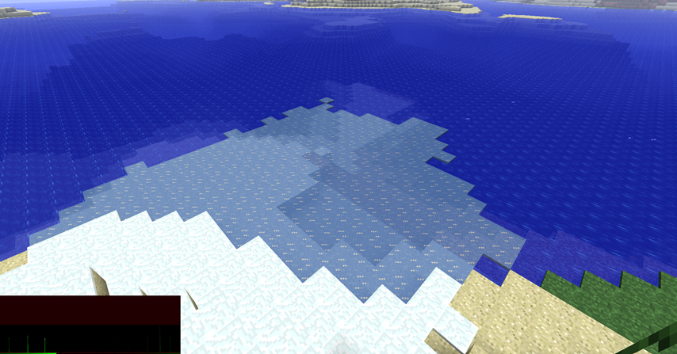
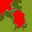
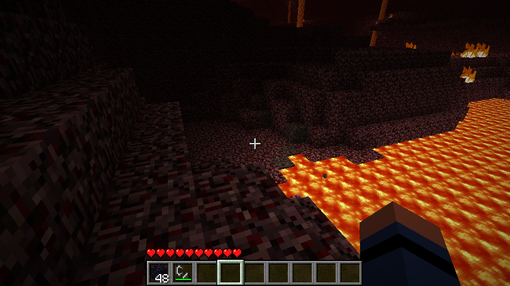
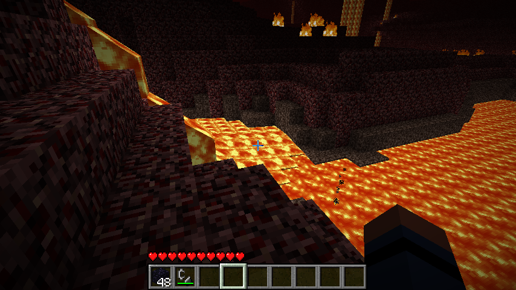

# Quirks

Quirks are often unintentional or unintuitive behaviors that occur due to poorly written or erroneous code. In spite of that, these are part of the Vanilla game, and a 100% accurate reimplementation should implement them as well.

## Blocks

### Wooden slab

Wooden slabs before 1.3.1 were retextured stone slabs. As a result, they required a Pickaxe to mine effectively, and produced stone particles when hit. The item was replaced by the modern wooden slab in 1.3.1, and renamed to "Petrified Oak Slab" in 1.13 ([See MC Wiki](https://minecraft.wiki/w/Petrified_oak_slab)).

## Items

TODO

## Generation

### Ice and Snow

Ice is generated during the [terrain shape stage](/worlds/generation/overworld#terrain-shape) anywhere the temperature is less than `0.5`. **However** this does not line up completely with the later determined biomes, which then determine where ice and snow can form via random ticking.

|                                                     Unticked                                                     |                                                   Ticked                                                    |
| :--------------------------------------------------------------------------------------------------------------: | :---------------------------------------------------------------------------------------------------------: |
|  |  |

This becomes more apparent when the relevant values are visualized.

|                                                                Biomes (Map Colors) + Temp < 0.5 (Red)                                                                 |
| :-------------------------------------------------------------------------------------------------------------------------------------------------------------------: |
|  |

<sub>Biome map with Map colors, Red marking where temperature values are less than 0.5</sub>

Snow depends on the same system to determine where it can appear, though its placed later in the [population stage](/worlds/generation/population).

> [!NOTE]
> Seed for this section is `-1712183887779554298`, showing the area around chunk `x: -1, z:6`

### Farlands

The farlands are an extremely well-known terrain-generation artifact that occurs approximately `+/-12,550,821` away from `(0,0)`. [The Minecraft Wiki has a highly detailed explanation of why they happen](<https://minecraft.wiki/w/Far_Lands_(Java_Edition)/Infdev_20100327_to_Beta_1.7.3#Cause>) but the simplified reason can be summed up as follows.

To read data from the perlin-noise permutation table, the position the noise is sampled at must be turned into an integer.

Due to how java Java converts between types (see [Casting](/technical/javaFeatures#casting)), the resulting 32-bit Integer (`int`) always lands on the same permutation table entry, giving us the familiar, infinitely stretching tunnels.

Using a signed 64-bit Integer (`long`) can fix this problem but it changes the tree and terrain generation slightly due to rounding differences.

### Nether

The Nether generator is very closely related to the overworld generation.

#### Not using the 2D fast path

The Nether samples the continentalness and depth noises with a max vertical size of `1`, which results in it not using the 2D fast-path that was added in Alpha 1.2.0 for 2D Perlin noise. This actually matches what the Overworld generator did before Alpha 1.2.0.

### Gravel and Soulsand don't generate along shores

While the laval level was changed to `32` for the main ocean of Lava, it's still `64` in the surface replacement step, resulting in Gravel and Soulsand not generating as intended.

|                                                    Original                                                     |                                                     Fixed                                                      |
| :-------------------------------------------------------------------------------------------------------------: | :------------------------------------------------------------------------------------------------------------: |
|  |  |

## Redstone

### Quasi-connectivity

TODO

### Double-trigger

If a Dispenser is already being powered by a lever or redstone torch, a buttons can trigger Dispensers twice on both when it presses and resets. This is because the Dispenser gets a redstone-based block update, then checks if its being powered, discovering the power by the lever/redstone torch.

## Entities

### Entity Id overflow

The id of entities is stored as a signed 32-bit integer, which has a maximum value of `2,147,483,647`. While it's unlikely for anyone to reach or suprass this number under normal circumstances, there are certain effects that potentially occur if this number ever overflows. Any situation where the game just immediately crashes will be ignored.

## Networking

### Client Packet Processing Limit

The Notchian Beta 1.7.3 Client can only process ~100 Packets per Tick. Any subsequent packets are thrown onto a buffer to be processed in subsequent ticks. It's trivial to overstep this limit with lots of entities sending their positions. While this doesn't result in a crash or frame drops, it does result in very nasty rubberbanding if the buffer isn't given a chance to clear out.

### Spawn Object Packet

The [spawn object packet](../networking/packets/023-spawn-object) determines if an entity, such as an Arrow, has an initial velocity by checking if the owner entity id is greater than `0`. If the global entity id overflows into the negatives, all arrows and fireballs would be sent without an initial velocity.

## Misc

### Username limits

Usernames must adhere to the following rules:

- Can only be >=3 or <=16 characters long
- Can contain upper/lowercase letters belonging to the latin alphabet
- Can contain numbers
- Can contain underscores

The following is every valid character for a username (ignoring the line breaks)

::: code-group

```text [Text]
ABCDEFGHIJKLMNOPQRSTUVWXYZ
abcdefghijklmnopqrstuvwxyz
0123456789
_
```

```c [C/C++]
char[] legal_characters = {
    'A','B','C','D','E','F','G','H','I','J','K','L','M','N','O','P','Q','R','S','T','U','V','W','X','Y','Z',
    'a','b','c','d','e','f','g','h','i','j','k','l','m','n','o','p','q','r','s','t','u','v','w','x','y','z',
    '0','1','2','3','4','5','6','7','8','9',
    '_'
};
```

:::

In the early days (around classic) these restrictions weren't as tough,
so some early players were able to snatch usernames with illegal characters.

### Renderable characters

Since the font rendering system of Beta 1.7.3 predates the inclusion of the [GNU Unifont](https://www.unifoundry.com/unifont/index.html) font to render any characters that the Minecraft font does not contain, the then available Minecraft font is all that's available. In addition to that, the actually usable range is further limited by what's inside of the `font.txt` file.

The following contains every legally printable character (ignoring the line breaks)

::: code-group

```text [Text]
 !"#$%&'()*+,-./
0123456789:;<=>?
@ABCDEFGHIJKLMNO
PQRSTUVWXYZ[\]^_
'abcdefghijklmno
pqrstuvwxyz{|}~⌂
ÇüéâäàåçêëèïîìÄÅ
ÉæÆôöòûùÿÖÜø£Ø׃
áíóúñѪº¿®¬½¼¡«»
```

```c [C/C++]
char[] valid_characters = {
    ' ','!','\"','#','$','%','&','\'','(',')','*','+',',','-','.','/',
    '0','1','2','3','4','5','6','7','8','9',':',';','<','=','>','?',
    '@','A','B','C','D','E','F','G','H','I','J','K','L','M','N','O',
    'P','Q','R','S','T','U','V','W','X','Y','Z','[','\\',']','^','_',
    'a','b','c','d','e','f','g','h','i','j','k','l','m','n','o',
    'p','q','r','s','t','u','v','w','x','y','z','{','|','}','~','⌂',
    'Ç','ü','é','â','ä','à','å','ç','ê','ë','è','ï','î','ì','Ä','Å',
    'É','æ','Æ','ô','ö','ò','û','ù','ÿ','Ö','Ü','ø','£','Ø','×','ƒ',
    'á','í','ó','ú','ñ','Ñ','ª','º','¿','®','¬','½','¼','¡','«','»'
};
```

:::

Values outside of this range cannot be rendered without mods.

> [!NOTE]
> The font is closely based on the IBM EGA 8x8 font, even using the exact same code-page layout and adopting the appearance of most non-character glyphs (Source: https://minecraft.wiki/w/Mojangles#Trivia)
