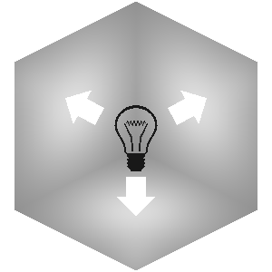
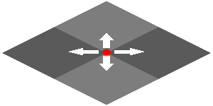

# Lighting

This section will go into how lighting data is rendered, not how it is calculated.

## Face lighting

Every block has constant directional lighting which is statically assigned based on
the angles of the faces. This is the base of all lighting thereafter, no matter whether it's smooth or not.

> [!NOTE]
> I haven't found a generalized formula to this yet but I'm sure there is one

```c
if (normal.y > 0.0f) {
    lighting = 1.0f;
} else if (normal.y < 0.0f) {
    lighting = 0.5f;
} else {
    lighting = (abs(normal.x) * 0.6) + (abs(normal.z) * 0.8);
}
```

_Source: [Betrock](https://github.com/OfficialPixelBrush/Betrock/blob/5c8e83318117e89ff50f74a2b78da0e802433d8d/src/external/shaders/minecraft.fsh)_

The resulting value is then multiplied with the underlying color.

## Light levels

Lighting in Minecraft is based on a 4-bit gradient from `0` - `15`. As of Indev, this relationship is no longer linear.

If mapped from a range of `0.0` - `1.0`, where `1.0` represents a light level of `15`, we get the following mapping.

| Value | Color                                         |
| ----: | :-------------------------------------------- |
|     0 | <ColorSwatch color="#080808" label="0.035"/>  |
|     1 | <ColorSwatch color="#0b0b0b" label="0.044" /> |
|     2 | <ColorSwatch color="#0e0e0e" label="0.055" /> |
|     3 | <ColorSwatch color="#111111" label="0.069" /> |
|     4 | <ColorSwatch color="#151515" label="0.086" /> |
|     5 | <ColorSwatch color="#1b1b1b" label="0.107" /> |
|     6 | <ColorSwatch color="#222222" label="0.134" /> |
|     7 | <ColorSwatch color="#2a2a2a" label="0.168" /> |
|     8 | <ColorSwatch color="#353535" label="0.21" />  |
|     9 | <ColorSwatch color="#424242" label="0.262" /> |
|    10 | <ColorSwatch color="#535353" label="0.328" /> |
|    11 | <ColorSwatch color="#686868" label="0.41" />  |
|    12 | <ColorSwatch color="#828282" label="0.512" /> |
|    13 | <ColorSwatch color="#a3a3a3" label="0.64" />  |
|    14 | <ColorSwatch color="#cccccc" label="0.8" />   |
|    15 | <ColorSwatch color="#ffffff" label="1.0" />   |

Or in code form

```c
const float lightArray[16] = { 0.035f, 0.044f, 0.055f, 0.069f, 0.086f, 0.107f, 0.134f, 0.168f, 0.21f, 0.262f, 0.328f, 0.41f, 0.512f, 0.64f, 0.8f, 1.0f };
```

## Non-smooth lighting

The illumination of a face is determined by the light level of the block its facing, i.e. the top of a grass block with a torch on it would get the full light level of `14`.



## Smooth Lighting

Every vertex samples and averages the light level of surrounding blocks along the direction of the face its part of. This provides ambient occlusion without any additional work, since solid blocks have a total light level of `0`.



### Credits

- [Vector image of incandescent light bulb pictogram (Public Domain)](https://publicdomainvectors.org/en/free-clipart/Vector-image-of-incandescent-light-bulb-pictogram/23310.html)
