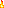
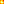

# Particles

Particles are 2D sprites that are there to spice up the look of Minecraft. They're all usually rendered as a billboard, to always face the player. Internally they're handled as entities.

## Generic Particles

These particles are reused for several things, and are indexed with a string id.

|        ID/Name | Appeareance                                                                                  | Usage                                                                                            |
| -------------: | :------------------------------------------------------------------------------------------- | :----------------------------------------------------------------------------------------------- |
|       `bubble` |                   | Usually spawned when entities are in water                                                       |
|        `smoke` |               | Used by torches, fireballs, furnaces, mob spawners and lava, but also primed TNT and Wolf taming |
|         `note` |        | Used by Noteblocks                                                                               |
|       `portal` |              | Spawned around Nether Portal blocks                                                              |
|      `explode` |                    | Used by explosions, but also as the smoke that appears when entities die                         |
|        `flame` |                | Used by torches, furnaces and mob spawners                                                       |
|         `lava` |               | Used by lava                                                                                     |
|     `footstep` |       | Unused                                                                                           |
|       `splash` |             | Used by boats, wet wolves shaking themselves off and for fish when fishing                       |
|   `largesmoke` |    | Used by fire, lava, furnace minecarts and water buckets when placed in the Nether                |
|      `reddust` |                | Used by powered redstone components                                                              |
| `snowballpoof` |     | Used by snowballs                                                                                |
|   `snowshovel` |  | Unused                                                                                           |
|        `slime` |           | Spawned when slimes land on the ground                                                           |
|        `heart` |                      | Used when a wolf is tamed                                                                        |

> [!NOTE]
> `snowballpoof`, `slime` and thrown eggs all use the same function under the hood. They just use different item textures.

## Block Destruction

Block Destruction particles are handled slightly differently. The game will spawn 64 particles, evenly spread out within the space the block occupied.

A random face is chosen as the source for the texture of each particle.
