# Textures

Textures are what give each rendered block their colorful, detailed appearance.

## Texture Atlas

The texture atlas contains all possible block textures in the game, and is `256x256` in the Vanilla game, where each individual block face is `16x16` pixels. Each block shares its textures with every other block, only having a unique appearance by zooming into and showing different parts of the atlas by using differing UV-Coordinates.

The texture atlas is indexed from `0` to `255`.

|   # | Row/Column |                       Texture                       | Label                          | Notes                                                                            |
| --: | :--------: | :-------------------------------------------------: | :----------------------------- | :------------------------------------------------------------------------------- |
|   0 |   `0,0`    |                  | Grass Top (Base)               | Biome Tinted                                                                     |
|   1 |   `0,1`    |                      | Stone                          |                                                                                  |
|   2 |   `0,2`    |           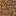            | Dirt                           |                                                                                  |
|   3 |   `0,3`    |        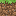         | Grass-side (Base)              |                                                                                  |
|   4 |   `0,4`    |          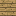           | Planks                         |                                                                                  |
|   5 |   `0,5`    |            | Stone Slab (Side)              |                                                                                  |
|   6 |   `0,6`    |             | Stone Slab (Top)               |                                                                                  |
|   7 |   `0,7`    |                     | Bricks                         |                                                                                  |
|   8 |   `0,8`    |                   | TNT (Side)                     |                                                                                  |
|   9 |   `0,9`    |                    | TNT (Top)                      |                                                                                  |
|  10 |   `0,10`   |                 | TNT (Bottom)                   |                                                                                  |
|  11 |   `0,11`   |                     | Cobweb                         |                                                                                  |
|  12 |   `0,12`   |                       | Rose                           |                                                                                  |
|  13 |   `0,13`   |                  | Dandelion                      |                                                                                  |
|  14 |   `0,14`   |         | Nether Portal (Placeholder)    | Pure blue                                                                        |
|  15 |   `0,15`   |                | Oak Sapling                    |                                                                                  |
|  16 |   `1,0`    |        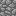        | Cobblestone                    |                                                                                  |
|  17 |   `1,1`    |                    | Bedrock                        |                                                                                  |
|  18 |   `1,2`    |                       | Sand                           |                                                                                  |
|  19 |   `1,3`    |          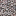           | Gravel                         |                                                                                  |
|  20 |   `1,4`    |               | Oak Log (Side)                 |                                                                                  |
|  21 |   `1,5`    |                    | Log (Top)                      | Used by all logs                                                                 |
|  22 |   `1,6`    |                 | Iron Block                     |                                                                                  |
|  23 |   `1,7`    |                 | Gold Block                     |                                                                                  |
|  24 |   `1,8`    |              | Diamond Block                  |                                                                                  |
|  25 |   `1,9`    |         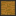         | Chest (Top/Bottom)             |                                                                                  |
|  26 |   `1,10`   |        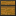         | Chest (Side)                   |                                                                                  |
|  27 |   `1,11`   |        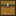        | Chest (Front)                  |                                                                                  |
|  28 |   `1,12`   |               | Red Mushroom                   |                                                                                  |
|  29 |   `1,13`   |      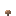       | Brown Mushroom                 |                                                                                  |
|  31 |   `1,15`   |           | Fire (Placeholder)             |                                                                                  |
|  32 |   `2,0`    |                   | Gold Ore                       |                                                                                  |
|  33 |   `2,1`    |         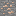          | Iron Ore                       |                                                                                  |
|  34 |   `2,2`    |                   | Coal Ore                       |                                                                                  |
|  35 |   `2,3`    |                  | Bookshelf                      |                                                                                  |
|  36 |   `2,4`    |          | Mossy Cobblestone              |                                                                                  |
|  37 |   `2,5`    |                   | Obsidian                       |
|  38 |   `2,6`    |                 | Grass-side (Overlay)           | Biome Tinted                                                                     |
|  39 |   `2,7`    |                  | Tallgrass                      | Biome Tinted                                                                     |
|  40 |   `2,8`    |                  | Grass Top (Overlay)            | Biome Tinted                                                                     |
|  41 |   `2,9`    |    | Double Chest (Front Left)      |                                                                                  |
|  42 |   `2,10`   | 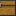  | Double Chest (Front Right)     |                                                                                  |
|  43 |   `2,11`   |         | Crafting Table (Top)           |                                                                                  |
|  44 |   `2,12`   |              | Furnace (Front)                |                                                                                  |
|  45 |   `2,13`   |     | Furnace/Dispenser (Side)       |                                                                                  |
|  46 |   `2,14`   |            | Dispenser (Front)              |                                                                                  |
|  47 |   `2,15`   |           | Fire (Placeholder)             |                                                                                  |
|  48 |   `3,0`    |                     | Sponge                         |                                                                                  |
|  49 |   `3,1`    |                      | Glass                          |                                                                                  |
|  50 |   `3,2`    |                | Diamond Ore                    |                                                                                  |
|  51 |   `3,3`    |       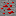        | Redstone Ore                   |                                                                                  |
|  52 |   `3,4`    |     | Oak/Birch leaves (Transparent) |                                                                                  |
|  53 |   `3,5`    |     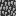     | Oak/Birch leaves (Opaque)      |                                                                                  |
|  55 |   `3,7`    |             | Deadbush/Shrub                 | Shrubs are Biome Tinted                                                          |
|  56 |   `3,8`    |                       | Fern                           |                                                                                  |
|  57 |   `3,9`    |  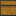   | Double Chest (Back Left)       |                                                                                  |
|  58 |   `3,10`   |  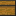  | Double Chest (Back Right)      |                                                                                  |
|  59 |   `3,11`   |   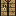   | Crafting Table (Side)          |                                                                                  |
|  60 |   `3,12`   |   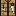   | Crafting Table (Side)          |                                                                                  |
|  61 |   `3,13`   |          | Lit Furnace (Front)            |                                                                                  |
|  62 |   `3,14`   |      | Furnace/Dispenser (Top)        |                                                                                  |
|  63 |   `3,15`   |      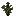       | Spruce Sapling                 |                                                                                  |
|  64 |   `4,0`    |                 | Wool (White)                   |                                                                                  |
|  65 |   `4,1`    |                | Mob Spawner                    |                                                                                  |
|  66 |   `4,2`    |                       | Snow                           |                                                                                  |
|  67 |   `4,3`    |                        | Ice                            |                                                                                  |
|  68 |   `4,4`    |      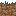      | Grass-side (Snow)              |                                                                                  |
|  69 |   `4,5`    |        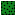         | Cactus (Top)                   |                                                                                  |
|  70 |   `4,6`    |                | Cactus (Side)                  |                                                                                  |
|  71 |   `4,7`    |              | Cactus (Bottom)                |                                                                                  |
|  72 |   `4,8`    |                       | Clay                           |                                                                                  |
|  73 |   `4,9`    |                  | Sugarcane                      |                                                                                  |
|  74 |   `4,10`   |     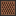     | Noteblock/Jukebox              |                                                                                  |
|  75 |   `4,11`   |                | Jukebox (Top)                  |                                                                                  |
|  79 |   `4,15`   |              | Birch Sapling                  |                                                                                  |
|  80 |   `5,0`    |                      | Torch                          |                                                                                  |
|  81 |   `5,1`    |      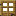      | Wooden Door (Top)              |                                                                                  |
|  82 |   `5,2`    |              | Iron Door (Top)                |                                                                                  |
|  83 |   `5,3`    |                     | Ladder                         |                                                                                  |
|  84 |   `5,4`    |         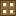          | Trapdoor                       |                                                                                  |
|  86 |   `5,6`    |       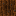        | Farmland (Wet)                 |                                                                                  |
|  87 |   `5,7`    |       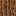        | Farmland (Dry)                 |                                                                                  |
|  88 |   `5,8`    |              | Wheat (Level 0)                |                                                                                  |
|  89 |   `5,9`    |              | Wheat (Level 1)                |                                                                                  |
|  90 |   `5,10`   |              | Wheat (Level 2)                |                                                                                  |
|  91 |   `5,11`   |              | Wheat (Level 3)                |                                                                                  |
|  92 |   `5,12`   |              | Wheat (Level 4)                |                                                                                  |
|  93 |   `5,13`   |              | Wheat (Level 5)                |                                                                                  |
|  94 |   `5,14`   |              | Wheat (Level 6)                |                                                                                  |
|  95 |   `5,15`   |              | Wheat (Level 7)                |                                                                                  |
|  96 |   `6,0`    |                      | Lever                          |                                                                                  |
|  97 |   `6,1`    |    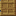     | Wooden Door (Bottom)           |                                                                                  |
|  98 |   `6,2`    |           | Iron Door (Bottom)             |                                                                                  |
|  99 |   `6,3`    |      | Redstone Torch (Active)        |                                                                                  |
| 102 |   `6,6`    |                | Pumpkin (Top)                  |                                                                                  |
| 103 |   `6,7`    |                 | Netherrack                     |                                                                                  |
| 104 |   `6,8`    |         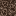         | Soul Sand                      |                                                                                  |
| 105 |   `6,9`    |                  | Glowstone                      |                                                                                  |
| 106 |   `6,10`   |    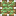    | Sticky Piston (Front)          |                                                                                  |
| 107 |   `6,11`   |       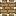        | Piston (Front)                 |                                                                                  |
| 108 |   `6,12`   |        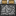        | Piston (Side)                  |                                                                                  |
| 109 |   `6,13`   |              | Piston (Bottom)                |                                                                                  |
| 110 |   `6,14`   |        | Piston (Inside Front)          |                                                                                  |
| 112 |   `7,0`    |                  | Rail (Turn)                    |                                                                                  |
| 113 |   `7,1`    |                 | Wool (Black)                   |                                                                                  |
| 114 |   `7,2`    |             | Wool (Dark Grey)               |                                                                                  |
| 115 |   `7,3`    |    | Redstone Torch (Inactive)      |                                                                                  |
| 116 |   `7,4`    |            | Spruce Log (Side)              |                                                                                  |
| 117 |   `7,5`    |             | Birch Log (Side)               |                                                                                  |
| 118 |   `7,6`    |               | Pumpkin (Side)                 |                                                                                  |
| 119 |   `7,7`    |              | Pumpkin (Front)                |                                                                                  |
| 120 |   `7,8`    |       | Jack o' Lantern (Front)        |                                                                                  |
| 121 |   `7,9`    |                   | Cake (Top)                     |                                                                                  |
| 122 |   `7,10`   |               | Cake (Outside)                 |                                                                                  |
| 123 |   `7,11`   |                | Cake (Inside)                  |                                                                                  |
| 124 |   `7,12`   |        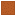        | Cake (Bottom)                  |                                                                                  |
| 128 |   `8,0`    |              | Rail (Straight)                |                                                                                  |
| 129 |   `8,1`    |                   | Wool (Red)                     |                                                                                  |
| 130 |   `8,2`    |                  | Wool (Pink)                    |                                                                                  |
| 131 |   `8,3`    |          | Repeater (Inactive)            |                                                                                  |
| 132 |   `8,4`    |  | Spruce leaves (Transparent)    |                                                                                  |
| 133 |   `8,5`    |       | Spruce leaves (Opaque)         |                                                                                  |
| 134 |   `8,6`    |                | Bed (Top End)                  |                                                                                  |
| 135 |   `8,7`    |               | Bed (Top Head)                 |                                                                                  |
| 140 |   `8,12`   |                  | Cake (Item)                    |                                                                                  |
| 144 |   `9,0`    |         | Lapis-Lazuli Block             |                                                                                  |
| 145 |   `9,1`    |            | Wool (Dark Green)              |                                                                                  |
| 146 |   `9,2`    |                  | Wool (Lime Green)              |                                                                                  |
| 147 |   `9,3`    |            | Repeater (Active)              |                                                                                  |
| 149 |   `9,5`    |              | Bed (Front End)                |                                                                                  |
| 150 |   `9,6`    |               | Bed (Side End)                 |                                                                                  |
| 151 |   `9,7`    |              | Bed (Side Head)                |                                                                                  |
| 152 |   `9,8`    |             | Bed (Front Head)               |                                                                                  |
| 160 |   `10,0`   |     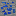      | Lapis-Lazuli Ore               |                                                                                  |
| 161 |   `10,1`   |                 | Wool (Brown)                   |                                                                                  |
| 162 |   `10,2`   |                | Wool (Yellow)                  |                                                                                  |
| 163 |   `10,3`   |     | Powered Rails (Inactive)       |                                                                                  |
| 164 |   `10,4`   |             | Redstone (Cross)               |                                                                                  |
| 165 |   `10,5`   |              | Redstone (Line)                |                                                                                  |
| 176 |   `11,0`   |              | Sandstone (Top)                |                                                                                  |
| 177 |   `11,1`   |             | Wool (Dark Blue)               |                                                                                  |
| 178 |   `11,2`   |            | Wool (Light Blue)              |                                                                                  |
| 179 |   `11,3`   |       | Powered Rails (Active)         |                                                                                  |
| 192 |   `12,0`   |             | Sandstone (Side)               |                                                                                  |
| 193 |   `12,1`   |                | Wool (Purple)                  |                                                                                  |
| 194 |   `12,2`   |               | Wool (Magenta)                 |                                                                                  |
| 195 |   `12,3`   |             | Activator Rail                 |                                                                                  |
| 205 |  `12,13`   |          | Water (Placeholder)            | Was replaced in [0.0.19a](https://minecraft.wiki/w/Java_Edition_Classic_0.0.19a) |
| 206 |  `12,14`   |          | Water (Placeholder)            | Was replaced in [0.0.19a](https://minecraft.wiki/w/Java_Edition_Classic_0.0.19a) |
| 207 |  `12,15`   |          | Water (Placeholder)            | Was replaced in [0.0.19a](https://minecraft.wiki/w/Java_Edition_Classic_0.0.19a) |
| 208 |   `13,0`   |           | Sandstone (Bottom)             |                                                                                  |
| 209 |   `13,1`   |                  | Wool (Cyan)                    |                                                                                  |
| 210 |   `13,2`   |                | Wool (Orange)                  |                                                                                  |
| 222 |  `13,14`   |          | Water (Placeholder)            | Was replaced in [0.0.19a](https://minecraft.wiki/w/Java_Edition_Classic_0.0.19a) |
| 223 |  `13,15`   |          | Water (Placeholder)            | Was replaced in [0.0.19a](https://minecraft.wiki/w/Java_Edition_Classic_0.0.19a) |
| 225 |   `14,1`   |                  | Wool (Grey)                    |                                                                                  |
| 237 |  `14,13`   |           | Lava (Placeholder)             | Was replaced in [0.0.19a](https://minecraft.wiki/w/Java_Edition_Classic_0.0.19a) |
| 238 |  `14,14`   |           | Lava (Placeholder)             | Was replaced in [0.0.19a](https://minecraft.wiki/w/Java_Edition_Classic_0.0.19a) |
| 239 |  `14,15`   |           | Lava (Placeholder)             | Was replaced in [0.0.19a](https://minecraft.wiki/w/Java_Edition_Classic_0.0.19a) |
| 240 |   `15,0`   |     | Block Breaking (Level 0)       |                                                                                  |
| 241 |   `15,1`   |     | Block Breaking (Level 1)       |                                                                                  |
| 242 |   `15,2`   |     | Block Breaking (Level 2)       |                                                                                  |
| 243 |   `15,3`   |     | Block Breaking (Level 3)       |                                                                                  |
| 244 |   `15,4`   |     | Block Breaking (Level 4)       |                                                                                  |
| 245 |   `15,5`   |     | Block Breaking (Level 5)       |                                                                                  |
| 246 |   `15,6`   |     | Block Breaking (Level 6)       |                                                                                  |
| 247 |   `15,7`   |     | Block Breaking (Level 7)       |                                                                                  |
| 248 |   `15,8`   |     | Block Breaking (Level 8)       |                                                                                  |
| 249 |   `15,9`   |     | Block Breaking (Level 9)       |                                                                                  |
| 254 |  `15,14`   |           | Lava (Placeholder)             | Was replaced in [0.0.19a](https://minecraft.wiki/w/Java_Edition_Classic_0.0.19a) |
| 255 |  `15,15`   |           | Lava (Placeholder)             | Was replaced in [0.0.19a](https://minecraft.wiki/w/Java_Edition_Classic_0.0.19a) |

Any spaces that're not filled with a texture are usually occupied by a pink grid-piece, or are entirely transparent.
| Empty | Transparent |
| :-------: | :-----------: |
|  |  |

These textures fully belong to Mojang, and we make no claim of ownership by presenting them on this page or other parts of the Wiki. Please see our [legal page](/legal) for more info.
