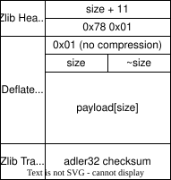

# Compression

Compression is used throughout many parts of Minecraft. The `level.dat` file is a `Gzip` compressed NBT file, while McRegion files are `Zlib`/`deflate` compressed NBT files.

# Deflate

Deflate is the basic algorithm that is mainly used by both Gzip and Zlib, which essentially just act as thin wrappers around it.

# Gzip

Gzip is an abstraction of the Deflate algorithm, adding some header and trailer info. It is used for most easily visible NBT files, namely `level.dat`.

# Zlib

Zlib is an abstraction of the Deflate algorithm, adding some basic error detection and more that the default Deflate data does not have. It is mostly used for compressing chunk data as part of the [McRegion format](../worlds/worldFormat#mcregion).

## Compressed data

For reading about how zlib itself works in more detail, I recommend checking out either the [zlib Wikipedia page](https://en.wikipedia.org/wiki/Gzip) or the [zlib RFC page](https://www.rfc-editor.org/rfc/rfc1950).

## Uncompressed data

Although this is a little unorthodox, it is entirely possible to store uncompressed data in a barebones zlib/deflate format. This is very useful for when you're writing everything from scratch and can't be bothered to implement an actual compression algorithm, or are running your code in a very resource constrained environment.

The basic idea boils down to disabling as many features as possible and forcing deflate to not use compression.

Here's some pseudocode, [based on the implementation from PicoCraft](https://github.com/OfficialPixelBrush/PicoCraft/blob/c2abf98c595bb47f0498e14726a26857c6382fa4/picocraft/picocraft.ino#L373), to illustrate the basic idea.

```c
// All numbers that're bigger than a byte are written in little endian ordering
// The header adds 11 bytes onto our payload
WriteU32(payloadSize + 11);
// DEFLATE Compression format
// 32K Window size (this doesn't matter,
// since we aren't compressing)
WriteByte(0x78)
// Flags = "Fastest" algorithm
WriteByte(0x01)
// Final Block flag (Bit-1) + Type (Bit-2 and 3)
// Type 0 is an uncompressed block
// This should be 0x00 if you're sending more data
WriteByte(0x01);
// Size of our data
WriteU16(payloadSize)
// One's Complement of our datas size
WriteU16(~payloadSize)
// The actual data
WriteBytes(payload, payloadSize);
// A 32-bit Adler Checksum is calculated and appended
WriteU32(Adler32(payload, payloadSize))
```

The final layout looks as follows.



## Adler32 Checksum

This is the checksum that goes at the end of a zlib header. This is based on the sample code from the [RFC page for the Zlib specification](https://www.rfc-editor.org/rfc/rfc1950#section-9), where you can find some more info on how and why it works.

```c
uint32_t adler32(uint8_t* payload, int32_t payloadSize) {
    uint32_t A = 1;
    uint32_t B = 0;
    for (uint32_t i = 0; i < payloadSize; i++) {
        A += payload[i];
        A = A % 65521;
        B += A;
        B = B % 65521;
    }
    return (B << 16) | A;
}
```

A more efficient implementation can be seen in the `zlib` source code or `js-adler32`. Check [Wikipedia](https://en.wikipedia.org/wiki/Adler-32#Example_implementation) for more info!

# Further reading

- [deflate (Wikipedia)](https://en.wikipedia.org/wiki/Deflate)
- [DEFLATE Compressed Data Format Specification version 1.3 (RFC)](https://www.rfc-editor.org/rfc/rfc1951)
- [gzip (Wikipedia)](https://en.wikipedia.org/wiki/Gzip)
- [GZIP file format specification version 4.3 (RFC)](https://www.rfc-editor.org/rfc/rfc1952)
- [zlib (Wikipedia)](https://en.wikipedia.org/wiki/Gzip)
- [ZLIB Compressed Data Format Specification version 3.3 (RFC)](https://www.rfc-editor.org/rfc/rfc1950)
- [Adler-32 (Wikipedia)](https://en.wikipedia.org/wiki/Adler-32)
