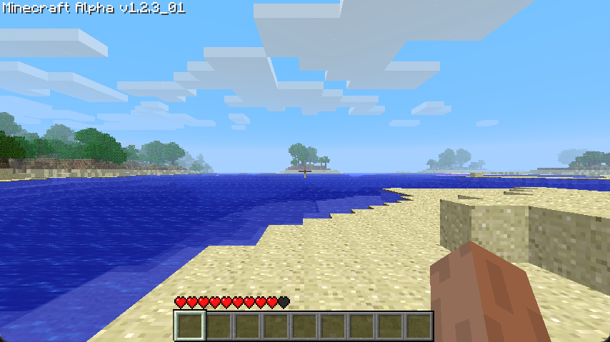

{: .missing }
> A huge chunk of info is still missing, mainly because I haven't yet worked my way to the Beta 1.7.3 Generator, so a lot will be guess-work or only relate to older versions.

# Generation
{: .no_toc }
The generation described in this section will explain how Minecraft Beta 1.7.3 does its Terrain Generation. A lot of this will be based on educated guesses and the decompilation provided by [RetroMCP](https://github.com/MCPHackers/RetroMCP-Java). Additionally, certain historical bits and pieces will be taken from the [Minecraft Wiki](https://minecraft.wiki/w/World_generation/History#Beta-era_terrain).

1. TOC
{:toc}

{: .note }
> The seed used throughout all of these comparisons is `3257840388504953787`, the seed behind [`pack.png`](https://minecraftathome.com/projects/packpng.html).

## History
The first version to have the Beta-era generator was Alpha 1.2.0, and it was used up until Beta 1.7.3.

However, we can see that the general shape of the terrain remains the same by using the same seed and spawn location in Alpha 1.1.2 (pre-rework), Alpha 1.2.3 (post-rework) and Beta 1.7.3.

| A1.1.2 | A1.2.3 |
| --- | --- |
|  |  |

This similar pre-1.2.0 generation dates all the way back to Infdev 20100624, before which the world generation looked entirely different.

| Inf20100624 | A1.1.2 |
| --- | --- |
|  |  |

Facing the other way reveals some of the more glaring differences between the generators.

| A1.1.2 | A1.2.3 |
| --- | --- |
|  |  |

Between Alpha 1.2.3 and Beta 1.7.3 there only exist minor differences, mainly relating to the feature generation.

| A1.2.3 | B1.7.3 |
| --- | --- |
|  |  |

## Biomes

This utilizes [Simplex Noise](../technical/noise#simplex-noise).

{: .missing }
> It seems that biomes are generated first to determine how terrain should be shaped, so having this step here would be useful.

### Temperature
TODO

### Humidity
TODO

## Terrain Shape
### Noise Octaves
The Beta 1.7.3 Terrain Generator has a shared [Pseudorandom Number Generator](../technical/random), alongside 8 [Octaved Perlin Noise Generators](../technical/noise), 7 of which are relevant for World generation.

| Generator | Octaves |
| --- | --- |
| Noise #0 | 16 |
| Noise #1 | 16 |
| Noise #2 | 8 |
| Noise #3 | 4 |
| Noise #4 | 4 |
| Noise #5 | 10 |
| Noise #6 | 16 |
| Mob Spawner Noise | 8 |

{: .missing }
> Figure out proper names for these generators!

### Algorithm
It appears that after putting some values into a double array, these values are used to generate the Terrain in vertical Chunks.

The basic loop looks roughly as follows.
```c
for(int macroX = 0; macroX < 4; ++macroX) {
  for(int macroZ = 0; macroZ < 4; ++macroZ) {
    for(int macroY = 0; macroY < 16; ++macroY) {
      // Get the values from the array
      for(int subY = 0; subY < 8; ++subY) {
        for(int subX = 0; subX < 4; ++subX) {
          for(int subZ = 0; subZ < 4; ++subZ) {
            // If the level is < 64, it's water
            // If noise is >0.0 the block is either stone or air
          }
        }
      }
    }
  }
}
```
Some of the values appear to modify themselves for the next loop.

<script>
  document.addEventListener("DOMContentLoaded", function () {
    mediumZoom('img', {
      margin: 10,
      background: '#000000CC'
    });
  });
</script>