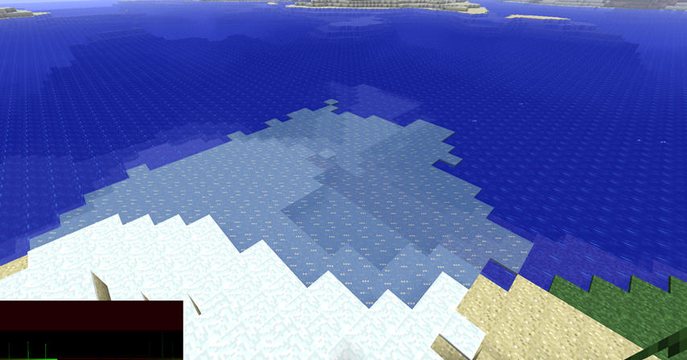

# Quirks

Quirks are (most likely) unintentional or unintuitive behaviors that occur during terrain generation.

## Ice and Snow

Ice is generated during the [terrain shape stage](generation#terrain-shape) anywhere the temperature is less than `0.5`. **However** this does not line up completely with the later determined biomes, which then determine where ice and snow can form via random ticking.

|                                                     Unticked                                                     |                                                   Ticked                                                    |
| :--------------------------------------------------------------------------------------------------------------: | :---------------------------------------------------------------------------------------------------------: |
|  |  |

This becomes more apparent when the relevant values are visualized.

|                                                                Biomes (Map Colors) + Temp < 0.5 (Red)                                                                 |
| :-------------------------------------------------------------------------------------------------------------------------------------------------------------------: |
|  |

Biome map with Map colors, Red marking where temperature values are less than 0.5

Snow depends on the same system to determine where it can appear, though its placed later in the [population stage](population).

> [!NOTE]
> Seed for this section is `-1712183887779554298`, showing the area around chunk `x: -1, z:6`

## Farlands

The farlands are an extremely well-known terrain-generation artifact that occurs approximately `+/-12,550,821` away from `(0,0)`. [The Minecraft Wiki has a highly detailed explanation of why they happen](<https://minecraft.wiki/w/Far_Lands_(Java_Edition)/Infdev_20100327_to_Beta_1.7.3#Cause>) but the simplified reason can be summed up as follows.

To read data from the perlin-noise permutation table, the position the noise is sampled at must be turned into an integer.

Due to how java Java converts between types (see [Casting](../technical/javaFeatures#casting)), the resulting 32-Bit Integer (`int`) always lands on the same permutation table entry, giving us the familiar, infinitely stretching tunnels.

Using a signed 64-Bit Integer (`long`) can fix this problem but it changes the tree and terrain generation slightly due to rounding differences.
